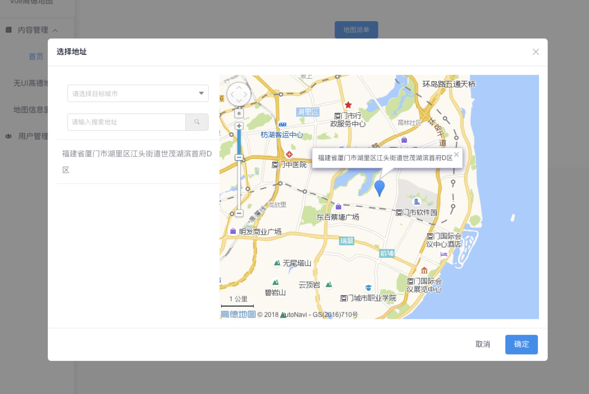
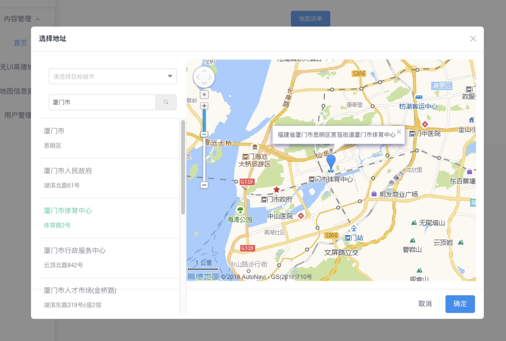
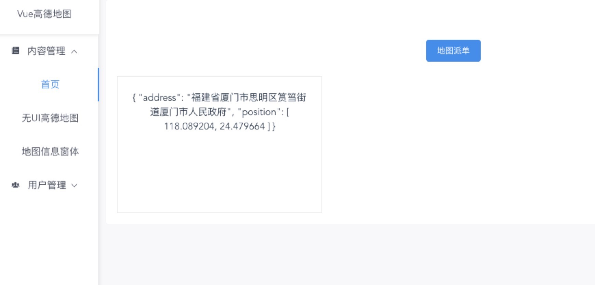
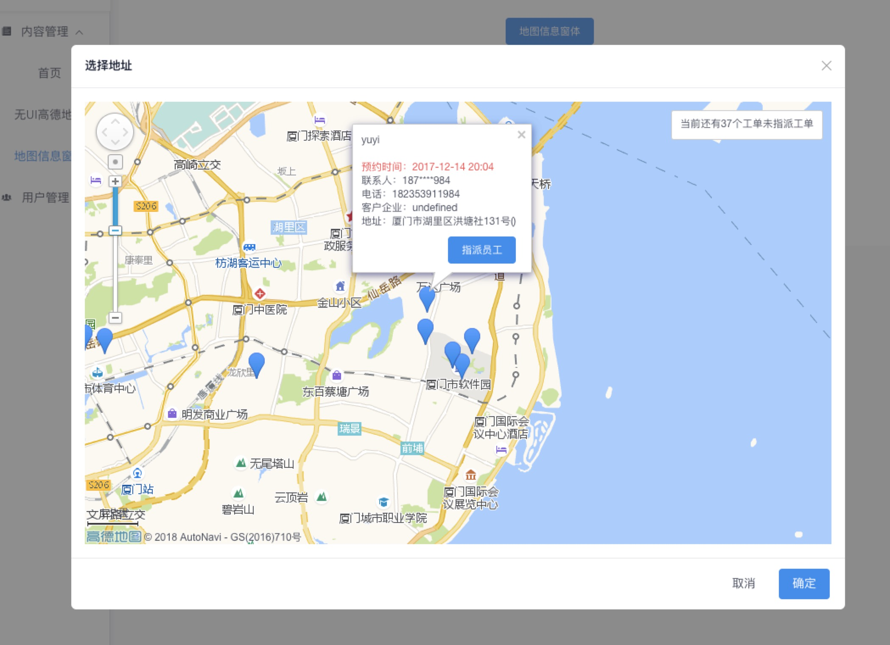
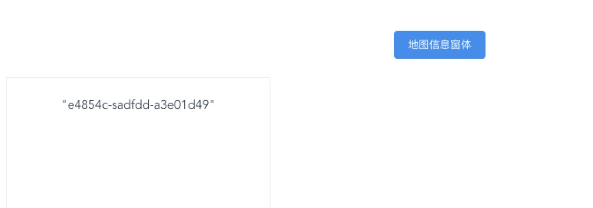
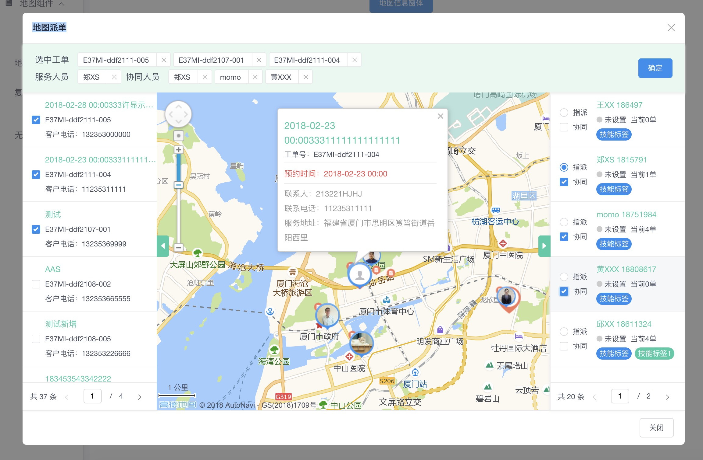

### Vue框架下 使用高德地图

> A Map Use Vue By QSY

- 该项目的基于 iView的UI框架开发的实例
[QSY项目链接](https://github.com/Shruan/AMapByVue)

## Build Setup

``` bash
# install dependencies
npm/cnpm install

# serve with hot reload at localhost:8880
npm run dev

# build for production with minification
npm run build

# build for production and view the bundle analyzer report
npm run build --report
```

### 实例1 地图选择组件







### 实例2 地图信息窗体




### 实例2 复杂地图信息窗体


For detailed explanation on how things work, checkout the [guide](http://vuejs-templates.github.io/webpack/) and [docs for vue-loader](http://vuejs.github.io/vue-loader).
[QSY项目链接](https://github.com/Shruan/AMapByVue)
